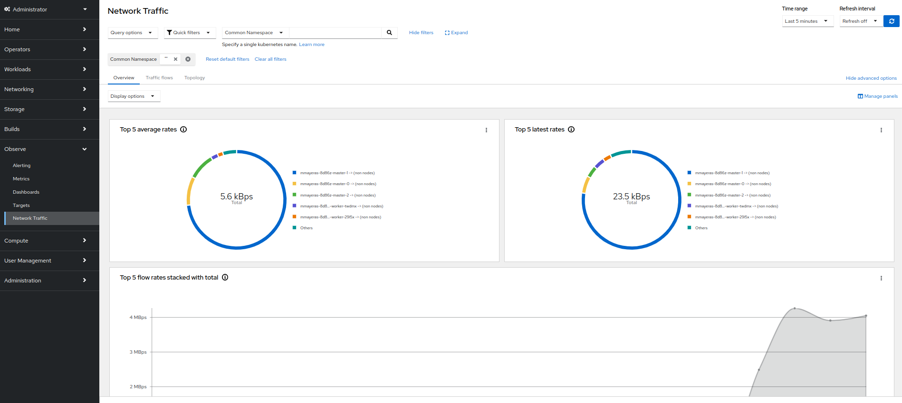

+++
title = "Network Observability"
date = 2023-02-09
+++

Red Hat offers cluster administrators the Network Observability Operator to observe the network traffic for OpenShift Container Platform clusters. The Network Observability uses the eBPF technology to create network flows. The network flows are then enriched with OpenShift Container Platform information and stored in Loki. You can view and analyze the stored network flows information in the OpenShift Container Platform console for further insight and troubleshooting.

[Network Observability Operator in OpenShift Container Platform](https://docs.openshift.com/container-platform/4.12/networking/network_observability/understanding-network-observability-operator.html)


#### In my LAB environment, I am using ODF Internal to provide object buckets.

#### First, let's create an object bucket claim.

```yaml
apiVersion: objectbucket.io/v1alpha1
kind: ObjectBucketClaim
metadata: 
  name: netobserv-bucket 
spec:
  storageClassName: ocs-storagecluster-ceph-rgw
  generateBucketName: netobserv-bucket 
```

#### Get the `AWS_ACCESS_KEY_ID` and `AWS_SECRET_ACCESS_KEY` from the secret generated :

```yaml
#$ oc get secret netobserv-bucket -o yaml
apiVersion: v1
data:
  AWS_ACCESS_KEY_ID: NzI0MEtCNU5SVThVVkRGUFVCRVY=
  AWS_SECRET_ACCESS_KEY: NzI0MEtCNU5SVThVVkRGUFVCRVY=
kind: Secret
...
```
#### Get the generated bucket name and S3 endpoint from the Object Bucket :
```yaml
#$ oc get objectbucket netobserv-bucket -o yaml
...
spec:
    additionalState:
      cephUser: ceph-user-foQpCUE6
    claimRef: {}
    endpoint:
      additionalConfig: {}
      bucketHost: rook-ceph-rgw-ocs-storagecluster-cephobjectstore.openshift-storage.svc
      bucketName: netobserv-bucket-0f653cc9-a18c-46a0-9316-d200302a7922
      bucketPort: 443
      region: ""
      subRegion: ""

...
```

#### Create a new secret using these values :

```yaml
apiVersion: v1
kind: Secret
metadata:
  name: network-observability-s3-secret
  namespace: netobserv
stringData:
  access_key_id: NzI0MEtCNU5SVThVVkRGUFVCRVY=
  access_key_secret: NzI0MEtCNU5SVThVVkRGUFVCRVY=
  endpoint: https://rook-ceph-rgw-ocs-storagecluster-cephobjectstore.openshift-storage.svc
  bucketNames: netobserv-bucket-0f653cc9-a18c-46a0-9316-d200302a7922
  region: ''
```


#### Lokistack


```yaml
apiVersion: loki.grafana.com/v1
kind: LokiStack
metadata:
  name: lokistack-netobserv
  namespace: netobserv 
spec:
  limits:
    global:
      queries:
        queryTimeout: 1m
  managementState: Managed
  size: 1x.extra-small
  storage:
    schemas:
    - effectiveDate: "2020-10-11"
      version: v11
    secret:
      name: network-observability-s3-secret
      type: s3
  storageClassName: thin
  tenants:
    mode: openshift-network


```
#### Install Network Oservability operator from Operator Hub

#### Create the following cluster role and cluster role binding

```yaml
apiVersion: rbac.authorization.k8s.io/v1
kind: ClusterRole
metadata:
  name: loki-netobserv-tenant
rules:
- apiGroups:
  - 'loki.grafana.com'
  resources:
  - network
  resourceNames:
  - logs
  verbs:
  - 'get'
  - 'create'
---
apiVersion: rbac.authorization.k8s.io/v1
kind: ClusterRoleBinding
metadata:
  name: loki-netobserv-tenant
roleRef:
  apiGroup: rbac.authorization.k8s.io
  kind: ClusterRole
  name: loki-netobserv-tenant
subjects:
- kind: ServiceAccount
  name: flowlogs-pipeline              
  namespace: netobserv
- kind: ServiceAccount
  name: netobserv-plugin               
  namespace: netobserv

```

#### Create a flow collector instance

```yaml
spec:
    loki:
        authToken: FORWARD
      
        app: netobserv-flowcollector
        statusUrl: https://lokistack-netobserv-query-frontend-http.netobserv.svc:3100
        tenantID: network
        tls:
            caCert:
                certFile: service-ca.crt #Leave blank if using self-signed certificate (default)
                name: lokistack-netobserv-gateway-ca-bundle #Leave blank if using self-signed certificate (default)
                type: configmap
            enable: true
            insecureSkipVerify: true
            userCert: {}
        url: https://lokistack-netobserv-gateway-http.netobserv.svc:8080/api/logs/v1/network/
    namespace: netobserv

```

#### Once installed, Refresh the console to enable the plugin




