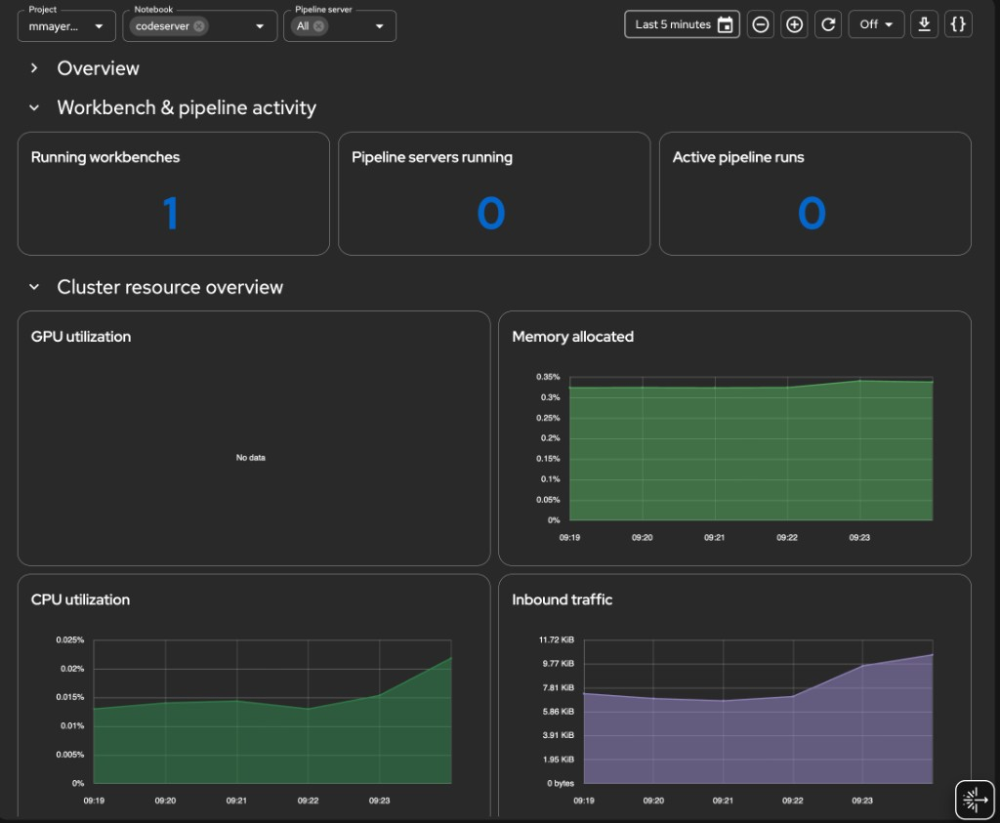
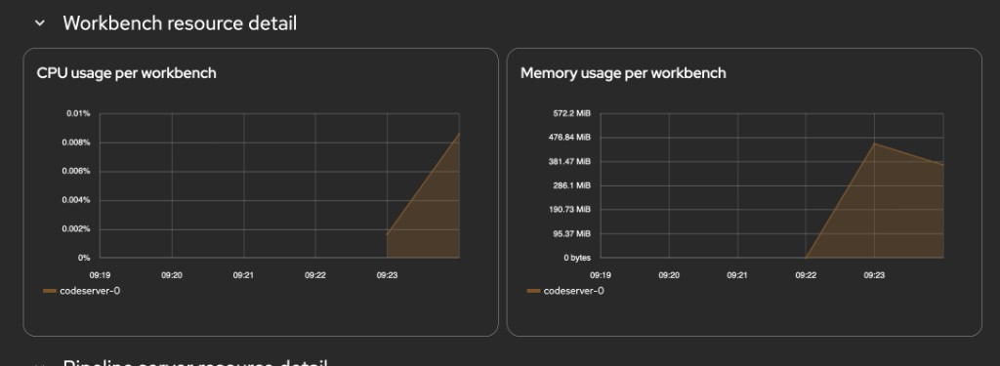
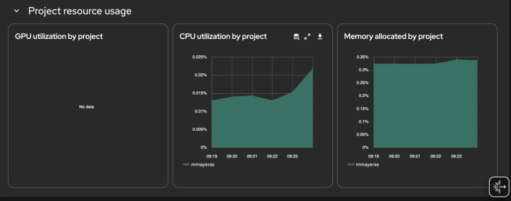

Deploy the [Cluster Observability Operator](https://github.com/rhobs/cluster-observability-operator) with its Perses UI plugin, then apply a **PersesDashboard** that surfaces Red Hat OpenShift AI workbench, pipeline server, and model-serving metrics directly in the OpenShift web console.

<!--more-->

## Prerequisites

- **Red Hat OpenShift AI** (RHOAI) is installed and at least one data science project exists (see [RHOAI docs](https://docs.redhat.com/en/documentation/red_hat_openshift_ai_self-managed/latest/html/installing_and_uninstalling_openshift_ai_self-managed/index)).
- `oc` available in `$PATH` with `cluster-admin` privileges.

## 1. Enable User Workload Monitoring

User Workload Monitoring (UWM) is required so RHOAI components can expose metrics to the `openshift-user-workload-monitoring` Prometheus.

```bash
cat <<EOF | oc apply -f -
apiVersion: v1
kind: ConfigMap
metadata:
  name: cluster-monitoring-config
  namespace: openshift-monitoring
data:
  config.yaml: |
    enableUserWorkload: true
EOF
```

Wait until the UWM stack is ready:

```bash
oc rollout status statefulset/prometheus-user-workload -n openshift-user-workload-monitoring
```

## 2. Install the Cluster Observability Operator

Create a **Subscription** in `openshift-operators` to pull COO from the `redhat-operators` catalog:

```bash
cat <<EOF | oc apply -f -
apiVersion: operators.coreos.com/v1alpha1
kind: Subscription
metadata:
  name: cluster-observability-operator
  namespace: openshift-operators
spec:
  channel: development <!-- VERIFY: confirm channel name in OperatorHub -->
  installPlanApproval: Automatic
  name: cluster-observability-operator
  source: redhat-operators
  sourceNamespace: openshift-marketplace
EOF
```

Confirm the operator pod reaches `Running`:

```bash
oc get pods -n openshift-operators -l app.kubernetes.io/name=observability-operator
```

## 3. Enable the Perses UI plugin

The **UIPlugin** resource instructs COO to deploy the Perses console plugin. Once active, `PersesDashboard` objects become navigable from the OpenShift web console under **Observe → Dashboards**.

```bash
cat <<EOF | oc apply -f -
apiVersion: observability.openshift.io/v1alpha1
kind: UIPlugin
metadata:
  name: perses
spec:
  type: Dashboards
EOF
```


The dashboard's `$namespace` variable queries `kube_namespace_labels` with `label_opendatahub_io_dashboard="true"` to enumerate ODH-owned projects. That metric is only available on the platform Prometheus (`openshift-monitoring`). If Perses is configured with a single UWM datasource, switch to the fallback matcher `kube_pod_labels{label_notebook_name!=""}` defined in the dashboard's variable comments.



## 4. Apply the PersesDashboard

The manifest creates a six-section dashboard in the `redhat-ods-monitoring` namespace (created by RHOAI at install time). The sections are:

| Section | Panels |
|---------|--------|
| Overview | System health, deployed models, GPU utilization, request success rate |
| Workbench & pipeline activity | Running workbenches, pipeline servers, active pipeline runs |
| Cluster resource overview | GPU / memory / CPU / inbound network time-series |
| Workbench resource detail | CPU and memory per workbench (filtered by `$notebook`) |
| Pipeline server resource detail | CPU, memory, and run activity per pipeline server |
| Project resource usage | GPU, CPU, memory stacked by project |

```bash
cat <<'EOF' | oc apply -f -
apiVersion: perses.dev/v1alpha1
kind: PersesDashboard
metadata:
  name: dashboard-rhoai-filters
  namespace: redhat-ods-monitoring
spec:
  display:
    name: Cluster Details per project
  duration: 1h

  # ---------------------------------------------------------------------------
  # Variables
  # ---------------------------------------------------------------------------
  # NAMESPACE GUARD STRATEGY
  # ─────────────────────────
  # Perses datasource is openshift-user-workload-monitoring (UWM). That
  # Prometheus does not have kube_namespace_labels, so per-query joins on
  # that metric are not possible.
  #
  # The ODH namespace allowlist is enforced at the variable level:
  #   - $namespace is populated from kube_namespace_labels via the PLATFORM
  #     Prometheus (openshift-monitoring), which does have that metric.
  #   - Every panel query uses {namespace=~"$namespace"} which at render
  #     time resolves to the ODH-only namespace list from the variable.
  #
  # If Perses uses a single datasource for both variables and panels, the
  # $namespace variable will populate from UWM kube_namespace_labels — in
  # that case fall back to the pod-label based matcher (see comment below).
  # ---------------------------------------------------------------------------
  variables:

    # 1. Project / Namespace
    - kind: ListVariable
      spec:
        name: namespace
        display:
          name: Project
          description: Filter by RHOAI project
        allowMultiple: false
        allowAllValue: true
        customAllValue: ".*"
        defaultValue: "$__all"
        plugin:
          kind: PrometheusLabelValuesVariable
          spec:
            datasource:
              kind: PrometheusDatasource
            labelName: namespace
            matchers:
              # kube_namespace_labels exists in platform Prometheus.
              # If this returns empty (UWM datasource), use the fallback below.
              - kube_namespace_labels{label_opendatahub_io_dashboard="true"}
              # Fallback: uncomment if above returns nothing
              # - kube_pod_labels{label_notebook_name!=""}

    # 2. Notebook — chained on $namespace
    - kind: ListVariable
      spec:
        name: notebook
        display:
          name: Notebook
          description: Filter by workbench
        allowMultiple: true
        allowAllValue: true
        customAllValue: ".*"
        defaultValue: "$__all"
        plugin:
          kind: PrometheusLabelValuesVariable
          spec:
            datasource:
              kind: PrometheusDatasource
            labelName: label_notebook_name
            matchers:
              - kube_pod_labels{namespace=~"$namespace", label_notebook_name!=""}

    # 3. Pipeline server — chained on $namespace
    - kind: ListVariable
      spec:
        name: pipeline_server
        display:
          name: Pipeline server
          description: Filter by pipeline server (DSPA)
        allowMultiple: true
        allowAllValue: true
        customAllValue: ".*"
        defaultValue: "$__all"
        plugin:
          kind: PrometheusLabelValuesVariable
          spec:
            datasource:
              kind: PrometheusDatasource
            labelName: label_dspa
            matchers:
              - kube_pod_labels{namespace=~"$namespace", label_dspa!=""}


  # ---------------------------------------------------------------------------
  # Panels
  # ---------------------------------------------------------------------------
  panels:

    # ── Overview stats ────────────────────────────────────────────────────────

    systemHealth:
      kind: Panel
      spec:
        display:
          name: System health
        plugin:
          kind: StatChart
          spec:
            calculation: mean
            format:
              unit: percent-decimal
        queries:
          - kind: TimeSeriesQuery
            spec:
              plugin:
                kind: PrometheusTimeSeriesQuery
                spec:
                  datasource:
                    kind: PrometheusDatasource
                  query: >
                    count(max by (node) (kube_node_status_condition{condition="Ready",status="true"} == 1))
                    / count(max by (node) (kube_node_status_condition{condition="Ready",status="true"}))
                  seriesNameFormat: System health

    deployedModels:
      kind: Panel
      spec:
        display:
          name: Deployed models
        plugin:
          kind: StatChart
          spec:
            calculation: last-number
            format:
              unit: decimal
              decimalPlaces: 0
        queries:
          - kind: TimeSeriesQuery
            spec:
              plugin:
                kind: PrometheusTimeSeriesQuery
                spec:
                  datasource:
                    kind: PrometheusDatasource
                  # Confirmed label: namespace (not exported_namespace)
                  query: >
                    count(
                      group by (model_name, namespace) (
                        vllm:num_requests_running{namespace=~"$namespace"}
                      )
                    )
                  seriesNameFormat: Deployed models

    gpuUtilizationStat:
      kind: Panel
      spec:
        display:
          name: GPU utilization
        plugin:
          kind: StatChart
          spec:
            calculation: mean
            format:
              unit: percent
        queries:
          - kind: TimeSeriesQuery
            spec:
              plugin:
                kind: PrometheusTimeSeriesQuery
                spec:
                  datasource:
                    kind: PrometheusDatasource
                  query: avg(accelerator_gpu_utilization{exported_namespace=~"$namespace"})
                  seriesNameFormat: GPU usage

    successRate:
      kind: Panel
      spec:
        display:
          name: Request success rate
        plugin:
          kind: StatChart
          spec:
            calculation: mean
            format:
              unit: percent-decimal
              decimalPlaces: 1
        queries:
          - kind: TimeSeriesQuery
            spec:
              plugin:
                kind: PrometheusTimeSeriesQuery
                spec:
                  datasource:
                    kind: PrometheusDatasource
                  # finished_reason confirmed. Using rate() instead of
                  # increase() so the panel shows data even when requests
                  # are infrequent within the selected time window.
                  # Falls back to last known ratio using max_over_time if
                  # rate returns 0.
                  query: >
                    (
                      sum(rate(vllm:request_success_total{namespace=~"$namespace", finished_reason=~"stop|length"}[$__rate_interval]))
                      /
                      sum(rate(vllm:request_success_total{namespace=~"$namespace"}[$__rate_interval]))
                    )
                    or
                    (
                      sum(max_over_time(vllm:request_success_total{namespace=~"$namespace", finished_reason=~"stop|length"}[$__range]))
                      /
                      sum(max_over_time(vllm:request_success_total{namespace=~"$namespace"}[$__range]))
                    )
                  seriesNameFormat: Request success rate

    # ── Workbench & pipeline activity ─────────────────────────────────────────

    runningNotebooks:
      kind: Panel
      spec:
        display:
          name: Running workbenches
        plugin:
          kind: StatChart
          spec:
            calculation: last-number
            format:
              unit: decimal
              decimalPlaces: 0
        queries:
          - kind: TimeSeriesQuery
            spec:
              plugin:
                kind: PrometheusTimeSeriesQuery
                spec:
                  datasource:
                    kind: PrometheusDatasource
                  query: >
                    count(
                      kube_pod_labels{
                        namespace=~"$namespace",
                        label_notebook_name!="",
                        label_notebook_name=~"$notebook"
                      }
                      * on(pod, namespace) group_left()
                      kube_pod_status_phase{phase="Running"}
                    ) or vector(0)
                  seriesNameFormat: Running workbenches

    runningPipelineServers:
      kind: Panel
      spec:
        display:
          name: Pipeline servers running
        plugin:
          kind: StatChart
          spec:
            calculation: last-number
            format:
              unit: decimal
              decimalPlaces: 0
        queries:
          - kind: TimeSeriesQuery
            spec:
              plugin:
                kind: PrometheusTimeSeriesQuery
                spec:
                  datasource:
                    kind: PrometheusDatasource
                  query: >
                    count(
                      count by (namespace, label_dspa) (
                        kube_pod_labels{
                          namespace=~"$namespace",
                          label_dspa!="",
                          label_dspa=~"$pipeline_server"
                        }
                        * on(pod, namespace) group_left()
                        kube_pod_status_phase{phase="Running"}
                      )
                    ) or vector(0)
                  seriesNameFormat: Pipeline servers

    activePipelineRuns:
      kind: Panel
      spec:
        display:
          name: Active pipeline runs
        plugin:
          kind: StatChart
          spec:
            calculation: last-number
            format:
              unit: decimal
              decimalPlaces: 0
        queries:
          - kind: TimeSeriesQuery
            spec:
              plugin:
                kind: PrometheusTimeSeriesQuery
                spec:
                  datasource:
                    kind: PrometheusDatasource
                  query: >
                    count(
                      kube_pod_labels{
                        namespace=~"$namespace",
                        label_workflows_argoproj_io_workflow!="",
                        label_dspa!="",
                        label_dspa=~"$pipeline_server"
                      }
                      * on(pod, namespace) group_left()
                      kube_pod_status_phase{phase="Running"}
                    ) or vector(0)
                  seriesNameFormat: Active pipeline runs

    # ── Cluster-wide area charts ──────────────────────────────────────────────

    gpuUtilizationArea:
      kind: Panel
      spec:
        display:
          name: GPU utilization
        plugin:
          kind: TimeSeriesChart
          spec:
            visual:
              areaOpacity: 0.6
              connectNulls: false
              display: line
              lineWidth: 1.5
            yAxis:
              format:
                unit: percent
              min: 0
        queries:
          - kind: TimeSeriesQuery
            spec:
              plugin:
                kind: PrometheusTimeSeriesQuery
                spec:
                  datasource:
                    kind: PrometheusDatasource
                  query: avg(accelerator_gpu_utilization{exported_namespace=~"$namespace"})
                  seriesNameFormat: GPU usage

    memoryUtilizationArea:
      kind: Panel
      spec:
        display:
          name: Memory allocated
        plugin:
          kind: TimeSeriesChart
          spec:
            visual:
              areaOpacity: 0.6
              connectNulls: false
              display: line
              lineWidth: 1.5
            yAxis:
              format:
                unit: percent-decimal
              min: 0
        queries:
          - kind: TimeSeriesQuery
            spec:
              plugin:
                kind: PrometheusTimeSeriesQuery
                spec:
                  datasource:
                    kind: PrometheusDatasource
                  query: >
                    sum(container_memory_working_set_bytes{namespace=~"$namespace", container!="", image!=""})
                    / scalar(sum(node_memory_MemTotal_bytes))
                  seriesNameFormat: Memory allocated

    cpuUtilizationArea:
      kind: Panel
      spec:
        display:
          name: CPU utilization
        plugin:
          kind: TimeSeriesChart
          spec:
            visual:
              areaOpacity: 0.6
              connectNulls: false
              display: line
              lineWidth: 1.5
            yAxis:
              format:
                unit: percent-decimal
              min: 0
        queries:
          - kind: TimeSeriesQuery
            spec:
              plugin:
                kind: PrometheusTimeSeriesQuery
                spec:
                  datasource:
                    kind: PrometheusDatasource
                  query: >
                    sum(node_namespace_pod_container:container_cpu_usage_seconds_total:sum_irate{namespace=~"$namespace"})
                    / scalar(sum(kube_node_status_allocatable{resource="cpu"}))
                  seriesNameFormat: CPU usage

    networkUtilizationArea:
      kind: Panel
      spec:
        display:
          name: Inbound traffic
        plugin:
          kind: TimeSeriesChart
          spec:
            visual:
              areaOpacity: 0.6
              connectNulls: false
              display: line
              lineWidth: 1.5
            yAxis:
              format:
                unit: bytes
              min: 0
        queries:
          - kind: TimeSeriesQuery
            spec:
              plugin:
                kind: PrometheusTimeSeriesQuery
                spec:
                  datasource:
                    kind: PrometheusDatasource
                  query: >
                    sum(rate(container_network_receive_bytes_total{namespace=~"$namespace"}[$__rate_interval]))
                  seriesNameFormat: Network

    # ── Workbench resource detail ─────────────────────────────────────────────

    notebookCpuByName:
      kind: Panel
      spec:
        display:
          name: CPU usage per workbench
        plugin:
          kind: TimeSeriesChart
          spec:
            legend:
              mode: list
              position: bottom
              values: []
            visual:
              areaOpacity: 0.4
              connectNulls: false
              display: line
              lineWidth: 1.5
            yAxis:
              format:
                unit: percent-decimal
              min: 0
        queries:
          - kind: TimeSeriesQuery
            spec:
              plugin:
                kind: PrometheusTimeSeriesQuery
                spec:
                  datasource:
                    kind: PrometheusDatasource
                  query: >
                    sum by (pod) (
                      node_namespace_pod_container:container_cpu_usage_seconds_total:sum_irate{
                        namespace=~"$namespace",
                        pod=~"($notebook)-0"
                      }
                    )
                    / scalar(sum(kube_node_status_allocatable{resource="cpu"}))
                  seriesNameFormat: "{{pod}}"

    notebookMemoryByName:
      kind: Panel
      spec:
        display:
          name: Memory usage per workbench
        plugin:
          kind: TimeSeriesChart
          spec:
            legend:
              mode: list
              position: bottom
              values: []
            visual:
              areaOpacity: 0.4
              connectNulls: false
              display: line
              lineWidth: 1.5
            yAxis:
              format:
                unit: bytes
              min: 0
        queries:
          - kind: TimeSeriesQuery
            spec:
              plugin:
                kind: PrometheusTimeSeriesQuery
                spec:
                  datasource:
                    kind: PrometheusDatasource
                  query: >
                    sum by (pod) (
                      container_memory_working_set_bytes{
                        namespace=~"$namespace",
                        pod=~"($notebook)-0",
                        container!="",
                        image!=""
                      }
                    )
                  seriesNameFormat: "{{pod}}"

    # ── Pipeline server resource detail ───────────────────────────────────────

    pipelineCpuByServer:
      kind: Panel
      spec:
        display:
          name: CPU usage per pipeline server
        plugin:
          kind: TimeSeriesChart
          spec:
            legend:
              mode: list
              position: bottom
              values: []
            visual:
              areaOpacity: 0.4
              connectNulls: false
              display: line
              lineWidth: 1.5
            yAxis:
              format:
                unit: percent-decimal
              min: 0
        queries:
          - kind: TimeSeriesQuery
            spec:
              plugin:
                kind: PrometheusTimeSeriesQuery
                spec:
                  datasource:
                    kind: PrometheusDatasource
                  query: >
                    sum by (pod) (
                      node_namespace_pod_container:container_cpu_usage_seconds_total:sum_irate{
                        namespace=~"$namespace",
                        pod=~"(ds-pipeline[^/]*-($pipeline_server)|mariadb-($pipeline_server)).*"
                      }
                    )
                    / scalar(sum(kube_node_status_allocatable{resource="cpu"}))
                  seriesNameFormat: "{{pod}}"

    pipelineMemoryByServer:
      kind: Panel
      spec:
        display:
          name: Memory usage per pipeline server
        plugin:
          kind: TimeSeriesChart
          spec:
            legend:
              mode: list
              position: bottom
              values: []
            visual:
              areaOpacity: 0.4
              connectNulls: false
              display: line
              lineWidth: 1.5
            yAxis:
              format:
                unit: bytes
              min: 0
        queries:
          - kind: TimeSeriesQuery
            spec:
              plugin:
                kind: PrometheusTimeSeriesQuery
                spec:
                  datasource:
                    kind: PrometheusDatasource
                  query: >
                    sum by (pod) (
                      container_memory_working_set_bytes{
                        namespace=~"$namespace",
                        pod=~"(ds-pipeline[^/]*-($pipeline_server)|mariadb-($pipeline_server)).*",
                        container!="",
                        image!=""
                      }
                    )
                  seriesNameFormat: "{{pod}}"

    pipelineRunActivity:
      kind: Panel
      spec:
        display:
          name: Pipeline run activity
        plugin:
          kind: TimeSeriesChart
          spec:
            legend:
              mode: list
              position: bottom
              values: []
            visual:
              areaOpacity: 0.6
              connectNulls: false
              display: bar
              lineWidth: 1
            yAxis:
              format:
                unit: decimal
              min: 0
        queries:
          - kind: TimeSeriesQuery
            spec:
              plugin:
                kind: PrometheusTimeSeriesQuery
                spec:
                  datasource:
                    kind: PrometheusDatasource
                  query: >
                    count by (phase) (
                      kube_pod_status_phase{namespace=~"$namespace"}
                      * on(pod, namespace) group_left()
                      kube_pod_labels{
                        label_workflows_argoproj_io_workflow!="",
                        label_dspa!="",
                        label_dspa=~"$pipeline_server",
                        namespace=~"$namespace"
                      }
                    )
                  seriesNameFormat: "{{phase}}"

    # ── Per-project breakdown ─────────────────────────────────────────────────

    gpuUtilizationByProject:
      kind: Panel
      spec:
        display:
          name: GPU utilization by project
        plugin:
          kind: TimeSeriesChart
          spec:
            legend:
              mode: list
              position: bottom
              values: []
            visual:
              areaOpacity: 1
              connectNulls: false
              display: line
              lineWidth: 0.25
              stack: all
            yAxis:
              format:
                unit: percent
              min: 0
        queries:
          - kind: TimeSeriesQuery
            spec:
              plugin:
                kind: PrometheusTimeSeriesQuery
                spec:
                  datasource:
                    kind: PrometheusDatasource
                  query: >
                    sum by (exported_namespace) (accelerator_gpu_utilization{exported_namespace=~"$namespace"})
                    / scalar(count(accelerator_gpu_utilization))
                  seriesNameFormat: "{{exported_namespace}}"

    cpuUtilizationByProject:
      kind: Panel
      spec:
        display:
          name: CPU utilization by project
        plugin:
          kind: TimeSeriesChart
          spec:
            legend:
              mode: list
              position: bottom
              values: []
            visual:
              areaOpacity: 1
              connectNulls: false
              display: line
              lineWidth: 0.25
              stack: all
            yAxis:
              format:
                unit: percent-decimal
              min: 0
        queries:
          - kind: TimeSeriesQuery
            spec:
              plugin:
                kind: PrometheusTimeSeriesQuery
                spec:
                  datasource:
                    kind: PrometheusDatasource
                  query: >
                    sum by (namespace) (
                      node_namespace_pod_container:container_cpu_usage_seconds_total:sum_irate{namespace=~"$namespace"}
                    )
                    / scalar(sum(kube_node_status_allocatable{resource="cpu"}))
                  seriesNameFormat: "{{namespace}}"

    memoryUsageByProject:
      kind: Panel
      spec:
        display:
          name: Memory allocated by project
        plugin:
          kind: TimeSeriesChart
          spec:
            legend:
              mode: list
              position: bottom
              values: []
            visual:
              areaOpacity: 1
              connectNulls: false
              display: line
              lineWidth: 0.25
              stack: all
            yAxis:
              format:
                unit: percent-decimal
              min: 0
        queries:
          - kind: TimeSeriesQuery
            spec:
              plugin:
                kind: PrometheusTimeSeriesQuery
                spec:
                  datasource:
                    kind: PrometheusDatasource
                  query: >
                    sum by (namespace) (
                      container_memory_working_set_bytes{namespace=~"$namespace", container!="", image!=""}
                    )
                    / scalar(sum(node_memory_MemTotal_bytes))
                  seriesNameFormat: "{{namespace}}"


  # ---------------------------------------------------------------------------
  # Layouts
  # ---------------------------------------------------------------------------
  layouts:

    - kind: Grid
      spec:
        display:
          title: Overview
          collapse:
            open: true
        items:
          - x: 0
            'y': 0
            width: 6
            height: 4
            content:
              '$ref': '#/spec/panels/systemHealth'
          - x: 6
            'y': 0
            width: 6
            height: 4
            content:
              '$ref': '#/spec/panels/deployedModels'
          - x: 12
            'y': 0
            width: 6
            height: 4
            content:
              '$ref': '#/spec/panels/gpuUtilizationStat'
          - x: 18
            'y': 0
            width: 6
            height: 4
            content:
              '$ref': '#/spec/panels/successRate'

    - kind: Grid
      spec:
        display:
          title: Workbench & pipeline activity
          collapse:
            open: true
        items:
          - x: 0
            'y': 0
            width: 8
            height: 4
            content:
              '$ref': '#/spec/panels/runningNotebooks'
          - x: 8
            'y': 0
            width: 8
            height: 4
            content:
              '$ref': '#/spec/panels/runningPipelineServers'
          - x: 16
            'y': 0
            width: 8
            height: 4
            content:
              '$ref': '#/spec/panels/activePipelineRuns'

    - kind: Grid
      spec:
        display:
          title: Cluster resource overview
          collapse:
            open: true
        items:
          - x: 0
            'y': 0
            width: 12
            height: 8
            content:
              '$ref': '#/spec/panels/gpuUtilizationArea'
          - x: 12
            'y': 0
            width: 12
            height: 8
            content:
              '$ref': '#/spec/panels/memoryUtilizationArea'
          - x: 0
            'y': 8
            width: 12
            height: 8
            content:
              '$ref': '#/spec/panels/cpuUtilizationArea'
          - x: 12
            'y': 8
            width: 12
            height: 8
            content:
              '$ref': '#/spec/panels/networkUtilizationArea'

    - kind: Grid
      spec:
        display:
          title: Workbench resource detail
          collapse:
            open: true
        items:
          - x: 0
            'y': 0
            width: 12
            height: 9
            content:
              '$ref': '#/spec/panels/notebookCpuByName'
          - x: 12
            'y': 0
            width: 12
            height: 9
            content:
              '$ref': '#/spec/panels/notebookMemoryByName'

    - kind: Grid
      spec:
        display:
          title: Pipeline server resource detail
          collapse:
            open: true
        items:
          - x: 0
            'y': 0
            width: 8
            height: 9
            content:
              '$ref': '#/spec/panels/pipelineCpuByServer'
          - x: 8
            'y': 0
            width: 8
            height: 9
            content:
              '$ref': '#/spec/panels/pipelineMemoryByServer'
          - x: 16
            'y': 0
            width: 8
            height: 9
            content:
              '$ref': '#/spec/panels/pipelineRunActivity'

    - kind: Grid
      spec:
        display:
          title: Project resource usage
          collapse:
            open: true
        items:
          - x: 0
            'y': 0
            width: 8
            height: 10
            content:
              '$ref': '#/spec/panels/gpuUtilizationByProject'
          - x: 8
            'y': 0
            width: 8
            height: 10
            content:
              '$ref': '#/spec/panels/cpuUtilizationByProject'
          - x: 16
            'y': 0
            width: 8
            height: 10
            content:
              '$ref': '#/spec/panels/memoryUsageByProject'
EOF
```

The three template variables exposed at the top of the dashboard are:

| Variable | Source metric | Purpose |
|----------|--------------|---------|
| `$namespace` | `kube_namespace_labels{label_opendatahub_io_dashboard="true"}` | Filter to ODH projects |
| `$notebook` | `kube_pod_labels{label_notebook_name!=""}` | Filter to specific workbenches |
| `$pipeline_server` | `kube_pod_labels{label_dspa!=""}` | Filter to specific DSPA instances |

## Verify

Confirm the **PersesDashboard** object is accepted:

```bash
oc get persesdashboard -n redhat-ods-monitoring
```

Expected output:

```
NAME                      AGE
dashboard-rhoai-filters   30s
```

Check that the UIPlugin reports a healthy status:

```bash
oc get uiplugin perses -o jsonpath='{.status.conditions}' | jq .
```

```json
[
  {
    "lastTransitionTime": "2026-04-21T10:00:00Z",
    "message": "UIPlugin is available",
    "reason": "Available",
    "status": "True",
    "type": "Available"
  }
]
```

Navigate to **Observe → Dashboards** in the OpenShift web console and select **Cluster Details per project** from the dropdown to access the dashboard.

## Screenshots

Workbench & pipeline activity, cluster resource overview:



Workbench resource detail — CPU and memory per workbench pod:



Project resource usage — GPU, CPU, and memory stacked by namespace:


